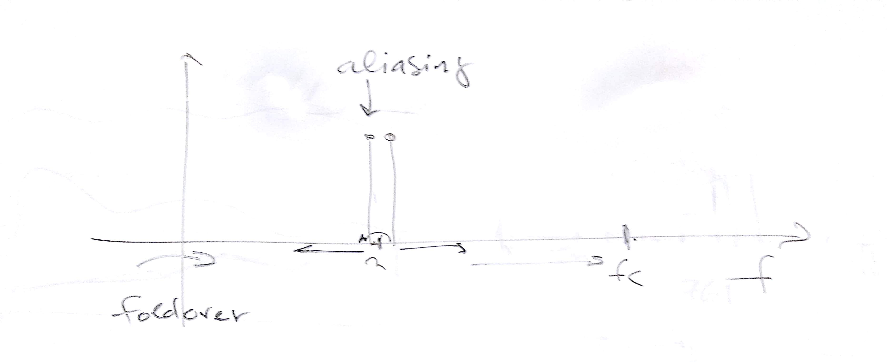
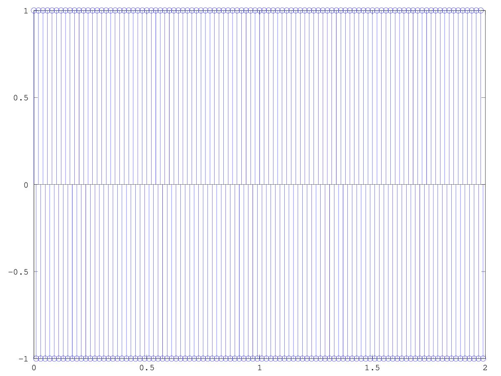

# CSEDSM 1 - Lezione del 5 dicembre 2018

## Argomenti

* Introduzione a `octave`
* Ripasso del teorema del campionamento:
  * aliasing
  * foldover

## Lavagne



## Esempi `matlab`

[cosinusoide a frequenza di nyquist](./Camp1.m)

```matlab
fc=100;
passo=1/fc;
dur=2;
t=[0:passo:dur-passo];
f=50;
w=f*2*pi;
y=cos(w*t);
stem(t,y);
```

Questo script realizza il seguente plot:


