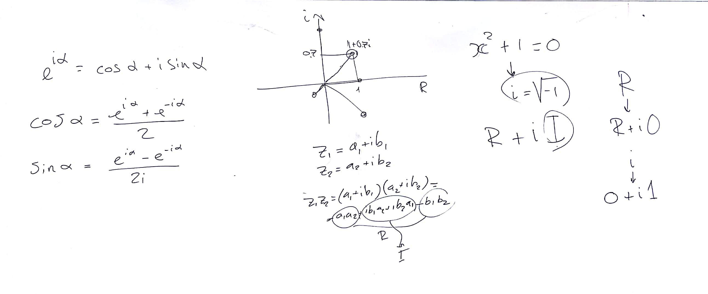
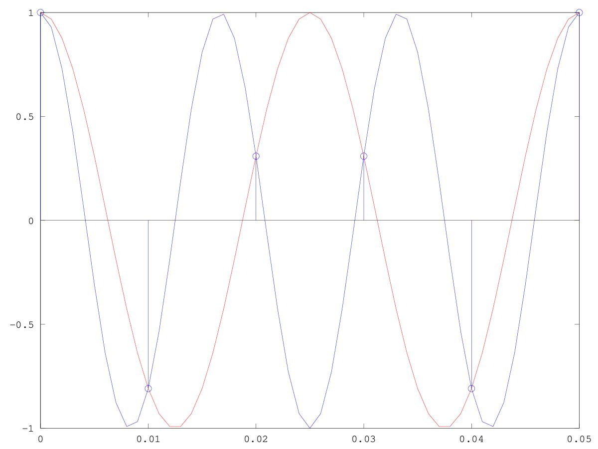
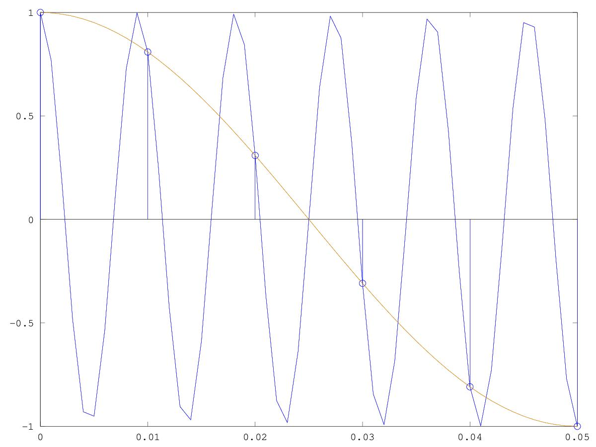

# CSEDSM 1 - Lezione del 12 dicembre 2018

## Argomenti

* Ripasso del teorema del campionamento:
  * rappresentazione del aliasing
  * rappresentazione del foldover

## Lavagne




## Esempi `matlab`

[cosinusoide oltre la frequenza di nyquist - aliasing](./Camp2.m)

```matlab
clear all
close all

fc=100;
fc2=1000;
passo2=1/fc2;
passo=1/fc;
dur=0.5;
t=[0:passo:dur-passo];
t2=[0:passo2:dur-passo2];
f=60;
w=f*2*pi;
y=cos(w*t);
y2=cos(w*t2);
y3=cos(40*2*pi*t2);
hold on
stem(t,y);
plot(t2,y2,t2,y3)
axis([0 0.05])
hold off

```

Questo script realizza il seguente plot:



[cosinusoide oltre la frequenza di campionamento - foldover](./Camp2fold.m)

```matlab
fc=100;
fc2=1000;
passo2=1/fc2;
passo=1/fc;
dur=0.5;
t=[0:passo:dur-passo];
t2=[0:passo2:dur-passo2];
f=110;
w=f*2*pi;
y=cos(w*t);
y2=cos(w*t2);
y3=cos(10*2*pi*t2);
hold on
stem(t,y);
plot(t2,y2,t2,y3)
axis([0 0.05])
hold off
```

Questo script produce il seguente plot:


