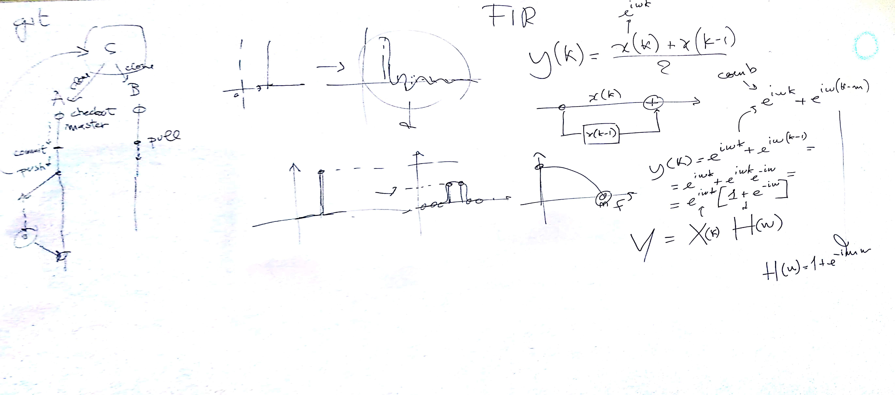

# CSEDSM 1 - Lezione del 16 gennaio 2019

## Argomenti

* messa a punto del progetto [*The Filter Game* (TFG)](https://github.com/SME-CCPPD/TFG):
  * introduzione a `git`
  * creazione del [repository `TFG`](https://github.com/SME-CCPPD/TFG)
* ripasso dei filtri di prim'ordine

## Lavagne

