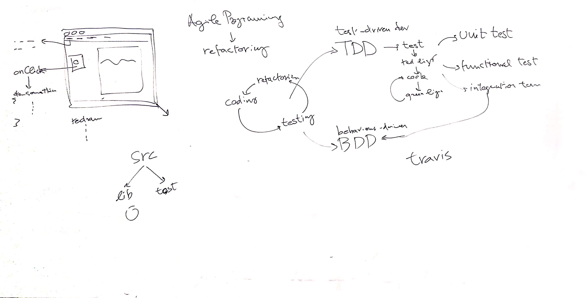
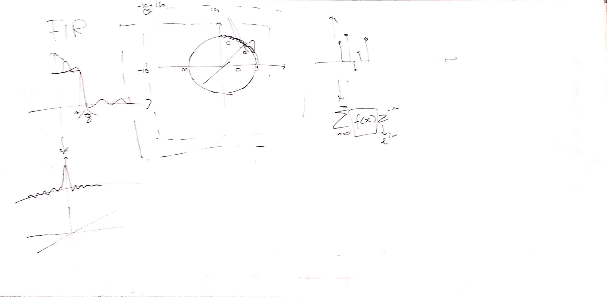
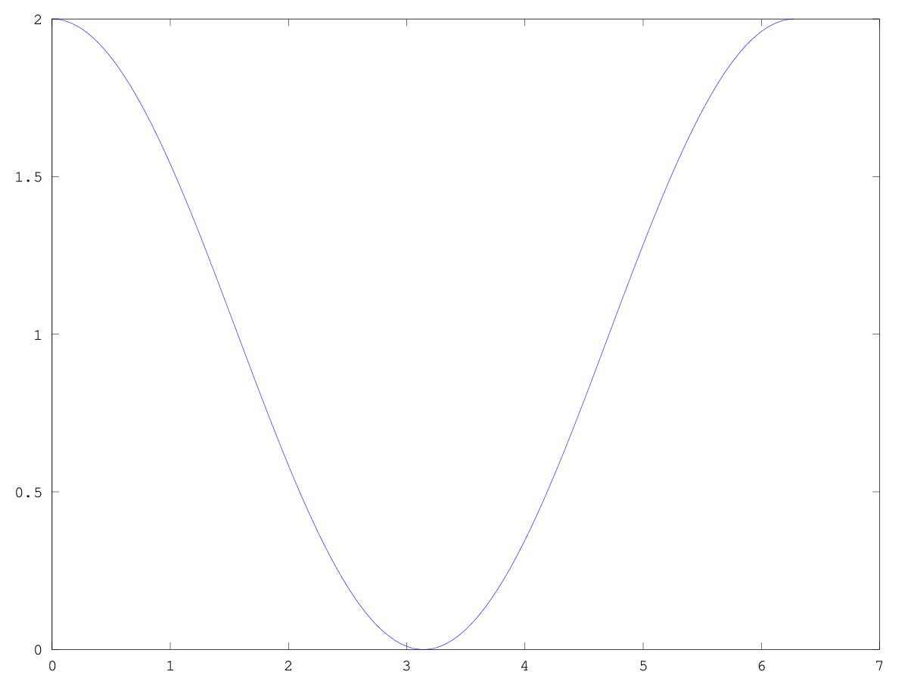
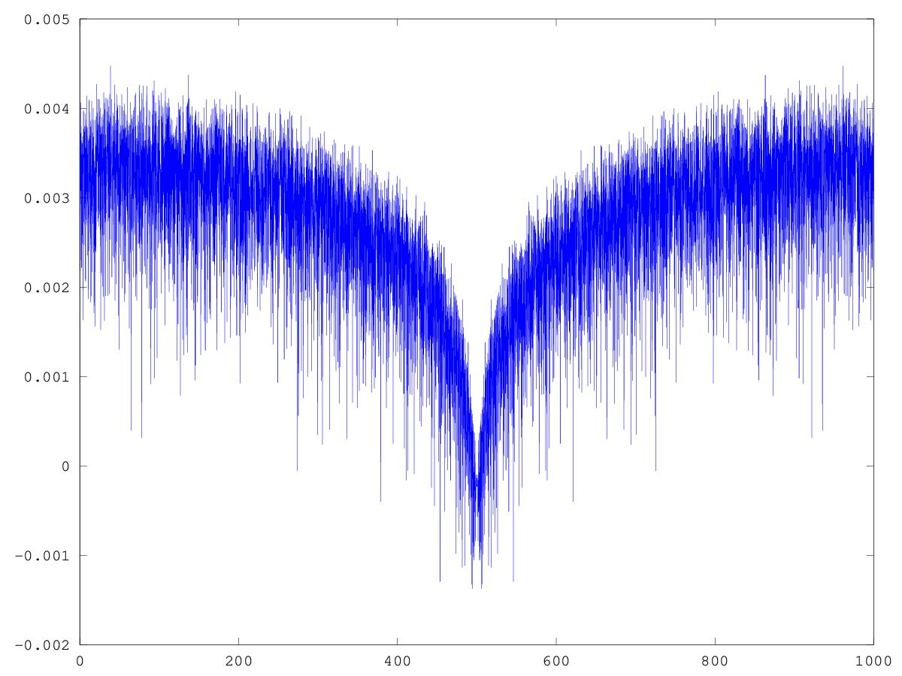
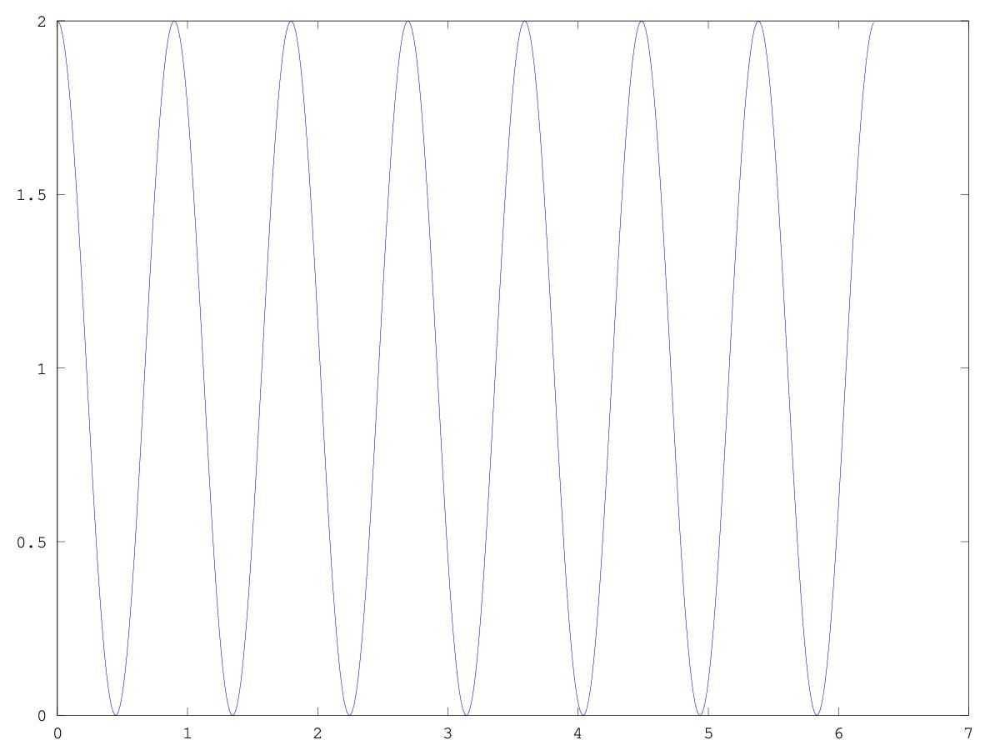

# CSEDSM 1 - Lezione del 6 febbraio 2019

## Argomenti

* riflessioni progettuali sulla costruzione del gioco [*The Filter Game* (TFG)](https://github.com/SME-CCPPD/TFG)
  * *object-oriented programming*
  * *agile programming paradigm*
  * *Test-driven development* (TDD)
  * *Behaviour-driven development*
* Modelli di rappresentazione di un filtro:
  * risposta in frequenza
  * risposta in fase
  * piano *Z*
  * poli e zeri
* Filtri *one-zero*
* Filtri *comb*

## Lavagne

## Grafici

Risposta in frequenza di un filtro *one-zero*:

