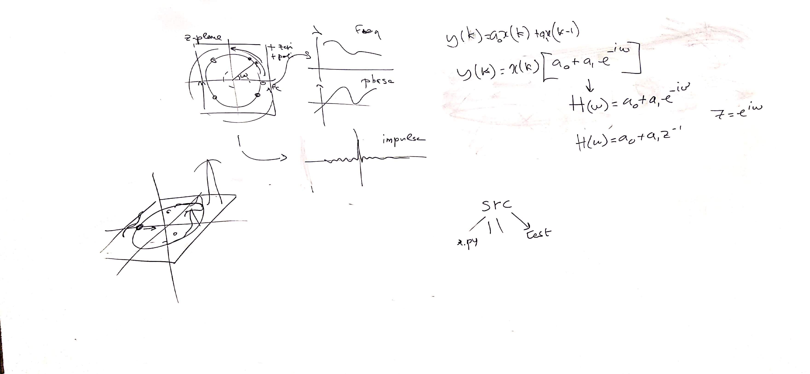

# CSEDSM 1 - Lezione del 20 febbraio 2019

## Argomenti

* riflessioni progettuali sulla costruzione del gioco [*The Filter Game* (TFG)](https://github.com/SME-CCPPD/TFG)
  * programmazione in `python`
  * elaborazione di una strategia di sviluppo
  * *unit tests*
* Modelli di rappresentazione di un filtro:
  * risposta in frequenza
  * risposta in fase
  * piano *Z*
  * poli e zeri

## Lavagne

